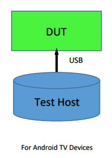

# CEC VTS testing for Android TV devices

Validate HDMI CEC VTS (android.hardware.tv.cec@1.0) functionality.

### Setup:

Running these CEC VTS tests requires an Android playback, TV or audio device connected to the host machine.



### Building

From the Android root folder, after choosing the lunch combo, use `make vts` to build VTS.

### Automation

On the host machine, ensure that the [software requirements](https://codelabs.developers.google.com/codelabs/android-lab/#2) for python SDK are met.

Given the setup described above you can run tests with any of the following commands:

1. Using vts-tradefed :
```
cd $ANDROID_BUILD_TOP/out/host/linux-x86/vts/android-vts/tools
./vts-tradefed run commandAndExit vts -m VtsHalTvCecV1_0TargetTest
```
2. Using atest
```
atest VtsHalTvCecV1_0TargetTest
```
Note : atest internally handles building as well. To update the test use '-c' (clear cache) option
